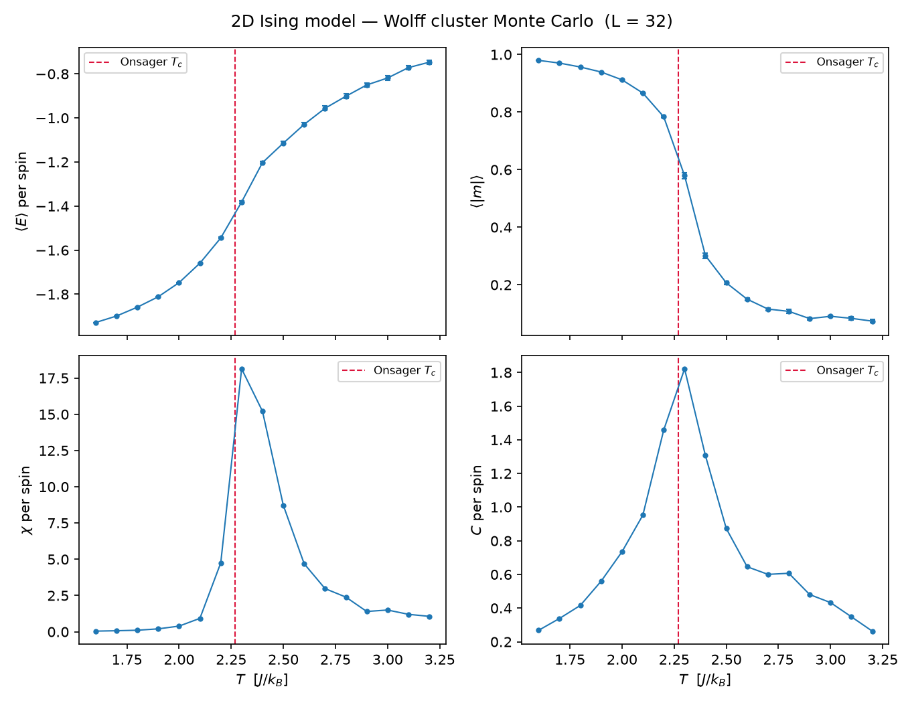
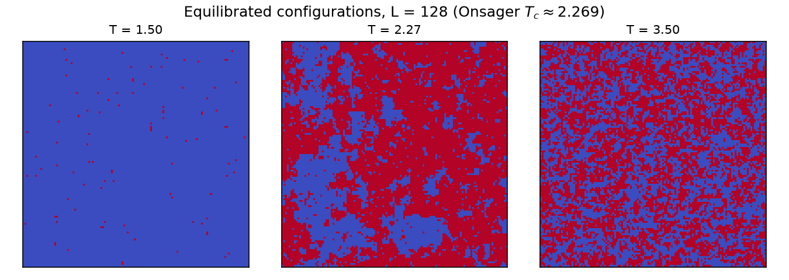

# spinlattice


**2D Ising model Monte Carlo — Metropolis and Wolff cluster dynamics, validated
against exact analytic results.**

Most Monte Carlo codes only check that they are self-consistent. This one is
tested against ground truth:

- The sampled mean energy of the 2×2 periodic lattice must match its
  **closed-form partition function** (all 16 states enumerable) — this pins
  down the Boltzmann distribution itself, for both single-flip and Wolff
  dynamics.
- The default checkerboard Metropolis rule is validated against a **full
  enumeration of all 65,536 states of the 4×4 lattice**.
- The Binder-cumulant crossing of two lattice sizes must land on
  **Onsager's exact critical temperature** T_c = 2/ln(1+√2) ≈ 2.269.
- The integrated autocorrelation time estimator is checked against the
  **analytic τ of an AR(1) process**.

These tests caught a real bug during development: on the degenerate 2×2
lattice every spin of a stripe configuration has ΔE = 0, so the deterministic
Metropolis "always flip when ΔE ≤ 0" makes simultaneous checkerboard updates
flip whole sublattices at once — stripe states become an unreachable closed
class and the chain silently samples a ~13% biased energy. The library now
refuses that combination (with a regression test demonstrating why) and
provides the provably ergodic **Glauber heat-bath rule**
(`rule="glauber"`, flip probability 1/(1+e^{βΔE})) used by GPU checkerboard
codes.





## Highlights

- **Checkerboard-vectorized single-flip dynamics** — the two sublattices of
  the square lattice are updated alternately with fully vectorized NumPy (no
  site loops): ~31M spin-updates/s on a 256×256 lattice (Apple M-series),
  with both Metropolis and Glauber acceptance rules.
- **Wolff cluster algorithm** — defeats critical slowing down near T_c
  (dynamic exponent z ≈ 0.25 vs ≈ 2.17 for single-spin flips), making
  near-critical measurements feasible.
- **Honest error bars** — blocking analysis and Sokal-windowed integrated
  autocorrelation times, not naive standard errors.
- **Finite-size scaling** — Binder cumulant U₄ crossings for T_c estimation.

## Install

```bash
pip install -e ".[dev]"
```

## Use

```bash
# Temperature sweep with Wolff dynamics + 4-panel figure
spinlattice sweep --size 32 --plot sweep.png

# Equilibrated configurations below / at / above T_c
spinlattice snapshots --size 128 --out snapshots.png

# Animated domain coarsening after a quench from T = ∞
spinlattice quench --size 128 --temperature 1.5 --out quench.gif

# Throughput benchmark
spinlattice bench --size 256
```

Or from Python:

```python
import numpy as np
from spinlattice import IsingLattice, run_wolff, ONSAGER_TC

lattice = IsingLattice(64, rng=np.random.default_rng(0))
obs = run_wolff(lattice, beta=1 / ONSAGER_TC, n_steps=5000, thermalization=1000)
print(obs["magnetization"].mean(), obs["energy"].mean())
```

## Tests

```bash
pytest -q     # 28 tests, including the exact-solution validations
ruff check .  # lint
```

## Physics notes

The Hamiltonian is H = −J Σ_⟨ij⟩ sᵢsⱼ − h Σᵢ sᵢ with periodic boundaries;
energies in units of J, temperatures in J/k_B. Susceptibility uses ⟨|m|⟩
(finite lattices don't spontaneously break symmetry over long runs). Wolff
moves are only detailed-balanced at h = 0 and the code enforces that.
